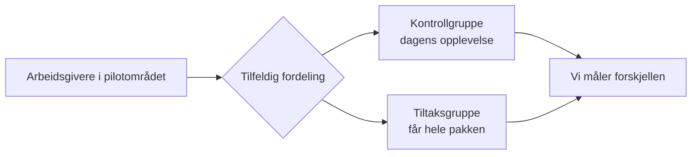

# 🎯 AID-oppdraget – dulting for bedre sykefraværsoppfølging

**AID** (Arbeids- og inkluderingsdepartementet) har gitt team eSyfo i oppdrag å utforske **[dulting](/ordbok#dulting)** — små, ærlige dult basert på adferdspsykologi — for å øke etterlevelsen av regelverket i sykefraværsoppfølgingen. Målet er at flere arbeidsgivere følger opp [tilretteleggingsplikten](/ordbok#tilretteleggingsplikt) sin, og at flere sykmeldte bidrar gjennom [medvirkningsplikten](/ordbok#medvirkningsplikt).

Denne delen av wikien dokumenterer AID-oppdraget: hva vi prøver ut, hvorfor, og hvordan vi måler det.

## Oppdraget

Oppdraget kommer fra **IA-avtalen 2025–2028**, der partene vil tydeliggjøre arbeidsgivers tilretteleggingsplikt og arbeidstakers medvirknings- og aktivitetsplikt. Team eSyfo er tildelt ansvaret for å:

> «utvikle konkret informasjon og veiledning fra Nav til arbeidsgivere og arbeidstakere om rettigheter og plikter … inkludert å utforske «dulting» som verktøy for å øke etterlevelsen av regelverket.»

I 2026 fokuserer vi på konkret og tilgjengelig informasjon tidlig i forløpet, og på å teste ulike tiltak knyttet til [oppfølgingsplanen](/omrader/oppfolgingsplan/) og dialogmøte 1.

## Slik henger begrepene sammen

AID-arbeidet har tre nivåer. Det er verdt å holde dem fra hverandre:

- **Tiltakspakke** – en samling tiltak som lanseres og testes **sammen** (A/B mot en kontrollgruppe). Vi måler effekten av pakken som helhet, ikke hvert tiltak for seg.
- **Dulte-tiltak** – selve adferdsgrepene, definert av nudgelab. Dette er intensjonsnivået: hva vi vil oppnå og hvorfor. Se [Dulte-tiltak (nudgelab)](./dulte-tiltak).
- **Funksjonelle endringer** – det vi faktisk bygger, som realiserer ett eller flere dulte-tiltak. Se [Funksjonelle endringer](./endringer).

## Det vi tester nå: Tiltakspakke 1 (oppfølgingsplan)

Første pakke er rettet mot oppfølgingsplanen tidlig i sykefraværet. Den består av flere funksjonelle endringer som lanseres samtidig og A/B-testes.

Slik jobber vi:

- **Alt lanseres kontinuerlig**, men er skrudd **av i produksjon** og **på i testmiljø og lokalt**. Da får vi integrert koden gradvis, uten en stor «big bang»-lansering.
- **A/B-test mot kontrollgruppe**, randomisert på **underenhet** (arbeidsgiver).
- **Pilot i Troms og Finnmark.**

Hvem som havner i hvilken gruppe styres av en egen tjeneste, Flaggskipet. Se [Funksjonelle endringer](./endringer#_15-a-b-styring-flaggskipet).

## Mål

Målene for oppdraget (tallfestingen er under arbeid):

**O1 – Redusert sykefravær ved bruk av dulting.** Delmål for oppfølgingsplan:

- 50 % av alle sykmeldte har fått vurdert behovet for en oppfølgingsplan innen uke 10 — målt gjennom flere eksperimenter rettet mot oppfølgingsplanen.
- Flere arbeidsgivere som får varsel om oppfølgingsplan i uke 4 sender faktisk planen — uten å vente på beskjed fra en veileder.

**O2 – Økt intern kompetanse i adferdspsykologi og dulting** i eSyfo og andre relevante team.

::: tip Måling
Hvordan vi måler effekten står på [Måling](./maaling). De gjeldende tertialmålene ligger på teamets prosjekttavle.
:::

## Spilleregler

Kort om hvordan vi jobber i AID:

- Fast ukessynk på tirsdager; tirsdag og onsdag er «dultedager».
- Jus og personvern inn **tidlig og løpende** — PVK og ROS er en integrert del av arbeidet, ikke noe vi tar til slutt.
- Vi setter bare i gang tiltak vi kan **måle**, og definerer forkastingskriterier på forhånd.
- Vi jobber i åpenhet: beslutninger dokumenteres, og oppgaver ligger i GitHub.

## Veien videre

Det kommer flere tiltakspakker etter denne — blant annet en tiltakspakke 2 for oppfølgingsplan, og senere pakker for andre deler av forløpet (for eksempel dialogmøte 1).

## Undersider

- [Funksjonelle endringer](./endringer) — hva vi bygger i Tiltakspakke 1, og status.
- [Dulte-tiltak (nudgelab)](./dulte-tiltak) — adferdsgrepene som ligger til grunn.
- [Måling](./maaling) — eksperimentelt design og effektmål.
