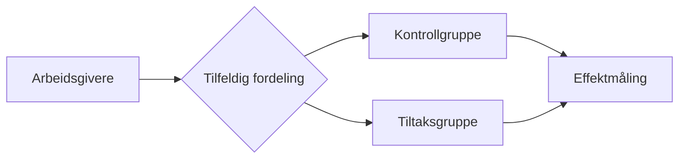

# 📊 Måling – Tiltakspakke 1

Vi setter bare i gang tiltak vi kan **måle**, og vi bestemmer på forhånd hva som skal til for å beholde eller forkaste et grep. Denne siden beskriver hvordan vi måler effekten av Tiltakspakke 1 på et overordnet nivå.

## Eksperimentelt design

Pakken testes som en **A/B-test** med to grupper:

- **Kontrollgruppe** – følger dagens brukerreise.
- **Tiltaksgruppe** – får brukerreisen med de nye dulte-tiltakene.

Vi randomiserer på **arbeidsgivernivå** (underenhet, ikke overenhet). Da får hver arbeidsgiver de samme tiltakene. Det hindrer at grupper blandes («treatment diffusion»), og sikrer at alle som følger opp hos samme arbeidsgiver får samme opplevelse. Effekten evalueres derfor på arbeidsgivernivå.

### Dataene henger sammen i nivåer

En arbeidsgiver kan ha flere ledere. Oppfølgingen av en sykmeldt gjøres vanligvis av nærmeste leder, men noen ganger av en annen — for eksempel sentral HR. Én leder kan følge opp én, flere eller ingen sykmeldte. For hver oppfølging registrerer vi én måling (for eksempel: ble det laget en plan eller ikke). Denne lagvise sammenhengen kalles en **nøstet datastruktur**.

| Arbeidsgiver | Den som følger opp | Måling |
|--------------|----------------|--------|
| AG-01 | Leder A | obs. 1, 2 |
| AG-01 | Leder B | obs. 3, 4 |
| AG-02 | Leder C | obs. 5, 6, 7 |

Poenget er at målingene ikke er uavhengige: de som følger opp hos samme arbeidsgiver jobber under samme rutiner og kultur, så målingene deres ligner mer på hverandre. Hvis vi ignorerer dette, tror vi at vi har sikrere tall enn vi har, og risikerer å overdrive effekten. Derfor bruker vi en analysemetode (flernivåmodell) som tar høyde for at målingene er gruppert under ledere og arbeidsgivere.

## Effektmål

### 1. Flere lager oppfølgingsplan innen uke 4 (hovedmål)

Vi registrerer om lederen har laget en plan, og hvilken uke i sykefraværet det skjedde. «Å lage en plan» er egentlig en trapp med flere trinn:

1. Begynne på en plan (utkast)
2. Dele planen med den sykmeldte (da låses den — «ferdigstilt»)
3. **Dele planen med legen** (knyttet til 4-ukers-regelverket)
4. Dele planen med Nav

Deling med legen innen uke 4 er trolig det viktigste trinnet, men vi ønsker oversikt over hele trappa.

### 2. Flere oppdaterer oppfølgingsplaner

Om lederen lager en ny plan etter at den første er på plass. Krever at vi vet at det allerede finnes en plan, og en tydelig frist for når planen bør være oppdatert.

### 3. Færre varslinger fra Nav-veileder i uke 8

Vi ønsker at tiltaksgruppen får færre veileder-varsler enn kontrollgruppen. Vi registrerer om det er sendt varsel per uke. Merk: variabelen måler om Nav *faktisk* sendte varsel, ikke om det burde vært sendt — men så lenge dette rammer begge gruppene likt, påvirker det ikke sammenligningen.

### 4. Tar lederen riktig valg når hen ikke lager plan?

Vi vil også forstå dem som velger å *ikke* lage en plan — var det et godt valg? Dette er en interessant tilleggsanalyse. **Hva vi har anledning til å måle her avklares med jurist og personvern** før vi går videre.

### 5. Varslinger

Her anbefaler vi dashboard-visninger for å forstå hvordan ledere og sykmeldte velger, for eksempel: Hvor mange velger å motta varslinger? Når velger de det?

### 6. Reduksjon i sykefravær

Krevende å måle, og vi deler det i to spørsmål:

- **Kommer sykmeldte raskere helt tilbake?** Antall uker fra sykmeldingen starter til personen jobber 100 %. Noen er ikke tilbake når forsøket avsluttes — da vet vi bare at det tok *minst* så lang tid (høyresensurering). Vi bruker forløpsanalyse som håndterer dette.
- **Jobber sykmeldte mer underveis?** Vi følger arbeidsgraden uke for uke og sammenligner gruppene.

## Dashboard

Målet er at teamet får et **dashboard** (trolig i Metabase) som følger utviklingen løpende. Vi løfter fram de viktigste metrikkene, men gjør det mulig å se de andre også. Da kan teamet se på dataene, stille gode spørsmål, og teste dem videre. En data scientist eier oppbyggingen av dashboardet.

## Åpne avklaringer

- Hvilket trinn i «lage plan»-trappa er det primære målet (lage plan vs. dele med lege)?
- Hva vi har anledning til å måle rundt dem som *ikke* lager plan (effektmål 4).

::: info Sammenheng
Se [Funksjonelle endringer](./endringer) for hva vi bygger, og [Dulte-tiltak](./dulte-tiltak) for adferdsgrepene som ligger til grunn.
:::
