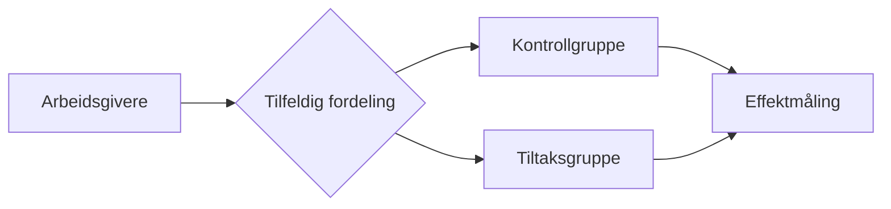

# 📊 Måling – Tiltakspakke 1

Vi setter bare i gang tiltak vi kan **måle**, og vi bestemmer på forhånd hva som skal til for å beholde eller forkaste et grep. Denne siden beskriver hvordan vi måler effekten av Tiltakspakke 1 på et overordnet nivå.

::: warning Avgrensning
Direkte analyse av sykefraværslengde er ikke tillatt i dette arbeidet. Vi analyserer ikke tid til friskmelding, retur til arbeid eller sykefraværsgrad. Dette er ikke en senere leveranse i dashboardplanen. Planhandlinger er et eget analysebehov; datakilde, tidsreferanse og eventuelle koblinger må være avklart og godkjent før resultatmåling settes i drift.
:::

Se [resultatmåling: definisjoner og datakrav](./resultatmaaling) for hva som mangler før vi kan vise andeler og sammenligne gruppene.

## Eksperimentelt design

Pakken testes som en **A/B-test** med to grupper:

- **Kontrollgruppe** – følger dagens brukerreise.
- **Tiltaksgruppe** – får brukerreisen med de nye dulte-tiltakene.

Piloten fordeler virksomheter innenfor Troms og Finnmark mellom tiltak og kontroll. Virksomheter utenfor pilotområdet er **utenfor scope**, ikke kontrollgruppe. Tildelingen kommer fra Flaggskipet, ikke fra hvilket skjema brukeren så. Manglende vurdering er ukjent, aldri kontroll.

Vi randomiserer på **arbeidsgivernivå** (underenhet, ikke overenhet). Da får hver arbeidsgiver de samme tiltakene. Det hindrer at grupper blandes («treatment diffusion»), og sikrer at alle som følger opp hos samme arbeidsgiver får samme opplevelse. Effekten evalueres derfor på arbeidsgivernivå.

```mermaid
flowchart LR
    A[Arbeidsgivere] --> B{Tilfeldig fordeling}
    B --> C[Kontrollgruppe]
    B --> D[Tiltaksgruppe]
    C --> E[Effektmåling]
    D --> E
```

### Dataene henger sammen i nivåer

En arbeidsgiver kan ha flere ledere. Oppfølgingen av en sykmeldt gjøres vanligvis av nærmeste leder, men noen ganger av en annen — for eksempel sentral HR. Én leder kan følge opp én, flere eller ingen sykmeldte. For hver oppfølging registrerer vi én måling (for eksempel: ble det laget en plan eller ikke). Denne lagvise sammenhengen kalles en **nøstet datastruktur**.

| Arbeidsgiver | Den som følger opp | Måling |
|--------------|----------------|--------|
| AG-01 | Leder A | obs. 1, 2 |
| AG-01 | Leder B | obs. 3, 4 |
| AG-02 | Leder C | obs. 5, 6, 7 |

Poenget er at målingene ikke er uavhengige: de som følger opp hos samme arbeidsgiver jobber under samme rutiner og kultur, så målingene deres ligner mer på hverandre. Hvis vi ignorerer dette, kan vi overvurdere sikkerheten i resultatet. Analyseansvarlig må velge en metode som tar høyde for randomisering på virksomhetsnivå og det faktiske datagrunnlaget; en bestemt modell er ikke fastsatt her.

## Effektmål

### 1. Flere lager oppfølgingsplan innen uke 4 (hovedmål)

Ambisjonen er å undersøke planhandlinger innen en avtalt frist, ikke sykefraværets varighet. «Innen uke 4» krever en godkjent tidsreferanse og avklart analysegrunnlag; dagens browserhendelser gir ikke dette. Vi må skille mellom disse handlingene:

1. Begynne på en plan (utkast)
2. Dele planen med den sykmeldte (da låses den — «ferdigstilt»)
3. **Dele planen med legen** (knyttet til 4-ukers-regelverket)
4. Dele planen med Nav

Hvilken handling som er primærmålet må avklares før analysen. Deling med lege og Nav er separate utfall, ikke obligatoriske trinn som alle følger i samme rekkefølge. Gjentatt deling og nye planversjoner må ikke telles som nye oppfølginger. Vi skal ikke beregne en trakt ved å dividere dagens hendelsestellere.

### 2. Flere oppdaterer oppfølgingsplaner

Om lederen lager en ny plan etter at den første er på plass. Krever at vi vet at det allerede finnes en plan, og en tydelig frist for når planen bør være oppdatert.

### 3. Færre varslinger fra Nav-veileder i uke 8

Vi ønsker at tiltaksgruppen får færre veileder-varsler enn kontrollgruppen. Vi registrerer om det er sendt varsel per uke. Merk: variabelen måler om Nav *faktisk* sendte varsel, ikke om det burde vært sendt — men så lenge dette rammer begge gruppene likt, påvirker det ikke sammenligningen.

### 4. Tar lederen riktig valg når hen ikke lager plan?

Vi vil også forstå dem som velger å *ikke* lage en plan — var det et godt valg? Dette er en interessant tilleggsanalyse. **Hva vi har anledning til å måle her avklares med jurist og personvern** før vi går videre.

### 5. Varslinger

Her anbefaler vi dashboard-visninger for å forstå hvordan ledere og sykmeldte velger, for eksempel: Hvor mange velger å motta varslinger? Når velger de det?

## Dashboard

For løpende produktoppfølging bruker vi [AID – bruk av tiltakspakke 1](./dashboard) i Grafana. Det viser registrerte ferdigstillinger av oppfølgingsplaner og valg av påminnelser i produksjon, ikke personer, sykefraværsforløp eller kausal effekt. Generelle backendtotaler inngår ikke, fordi de ikke kan avgrenses til forsøket. Det er et annet datagrunnlag enn effektanalysen beskrevet på denne siden.

Grafana viser levering og bruk nå. Resultatvisninger skal først få godkjente aggregater med tydelig datadekning, teller, nevner og usikkerhet. Analyseansvarlig må eie definisjonene og sammenligningsmetoden; visualiseringsverktøyet erstatter ikke dette.

## Åpne avklaringer

- Hvilket trinn i «lage plan»-trappa er det primære målet (lage plan vs. dele med lege)?
- Hva vi har anledning til å måle rundt dem som *ikke* lager plan (effektmål 4).

::: info Sammenheng
Se [Funksjonelle endringer](./endringer) for hva vi bygger, og [Dulte-tiltak](./dulte-tiltak) for adferdsgrepene som ligger til grunn.
:::
