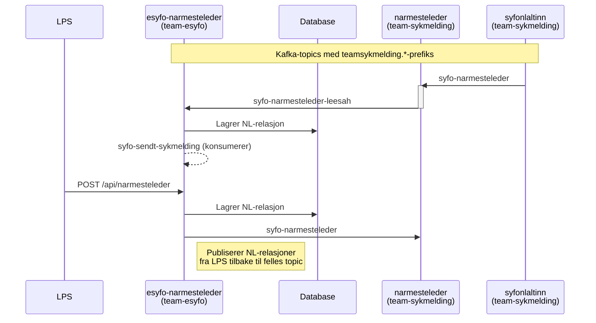

# Nærmeste leder

Nærmeste leder-løsningen håndterer relasjoner mellom sykmeldt og nærmeste leder. Målene er:

- **Motta nye relasjoner** fra eksisterende metoder (Altinn, sykmelding, narmesteleder-app)
- **Ta imot relasjoner fra frontender/LPS** i vår app og sende tilbake
- **Kunne kutte koblingen** til dagens system når alle avhengigheter er over

## Dataflyt

::: warning Avvik fra opprinnelig design
- **`nl-republisher`** ble aldri implementert — komponenten finnes ikke i noe repo.
- **Topic-prefikser** er korrigert fra `esfo-` til `teamsykmelding.syfo-*`.
- **`syfo-sendt-sykmelding`** er tillagt — `esyfo-narmesteleder` konsumerer dette topicet, men det var ikke med i det opprinnelige diagrammet.
:::
