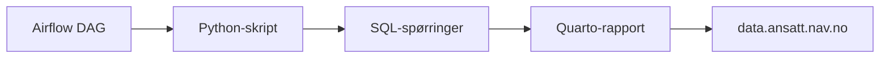

# Dataanalyse

Teknisk dokumentasjon for teamets dataanalyser og datafortellinger.

## Repo

[navikt/isyfo-analyse](https://github.com/navikt/isyfo-analyse) – kildekode for alle analyser og datafortellinger i teamet.

## Verktøy

| Verktøy | Bruksområde |
|---------|-------------|
| Python | Analysekode og datatransformasjoner |
| Quarto | Publisering av datafortellinger (notebooks → HTML) |
| Airflow | Orkestrering av daglige kjøringer (DAGs) |

## Pipeline

Analysene kjøres som Airflow DAGs og oppdateres daglig. Resultatet publiseres automatisk til [data.ansatt.nav.no](https://data.ansatt.nav.no).



## Mappestruktur

```
isyfo-analyse/
├── stories/          # Analysekode (Quarto-notebooks)
│   └── oppfolgingsplan/
│       └── nyoppfolgingsplan.py
├── dags/             # Airflow-jobber
│   └── oppfolgingsplan_dag.py
├── sql/              # SQL-spørringer
└── data/             # Mellomlagring av datasett
```

## Slik oppretter du en ny analyse

1. **Opprett analysefil** – Lag en ny `.py`-fil under `stories/<område>/`. Bruk en eksisterende fil som mal, for eksempel `stories/oppfolgingsplan/nyoppfolgingsplan.py`.
2. **Skriv SQL** – Legg spørringer i `sql/`-mappen og importer dem i analysefilen.
3. **Lag DAG** – Opprett en Airflow DAG i `dags/` som kjører analysen daglig. Se `dags/oppfolgingsplan_dag.py` for eksempel.
4. **Test lokalt** – Kjør analysen lokalt med `quarto render` for å verifisere at rapporten ser riktig ut.
5. **Push og deploy** – Merge til main. Airflow plukker opp ny DAG automatisk, og rapporten publiseres til data.ansatt.nav.no.

## Målgruppe

Utviklere og datascientist som skal opprette eller vedlikeholde analyser.

## Lenker

- [Alle datafortellinger for Syfo](https://data.ansatt.nav.no/search?text=syfo&preferredType=story)
- [Dataanalyse i oppfølgingsplan (fagside)](/omrader/oppfolgingsplan/dataanalyse)
