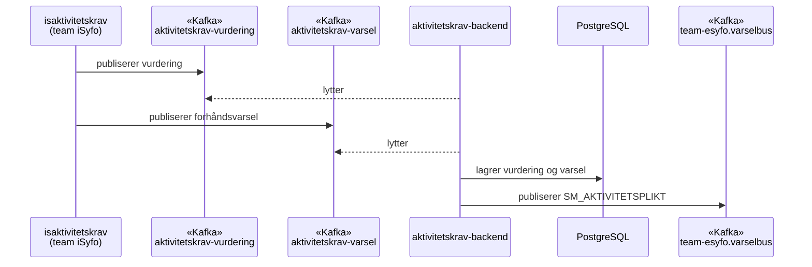
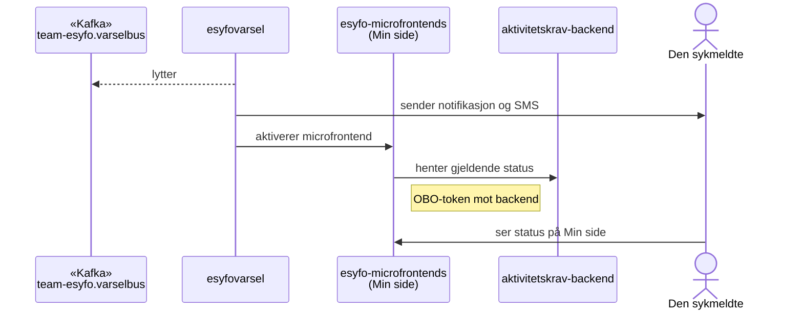
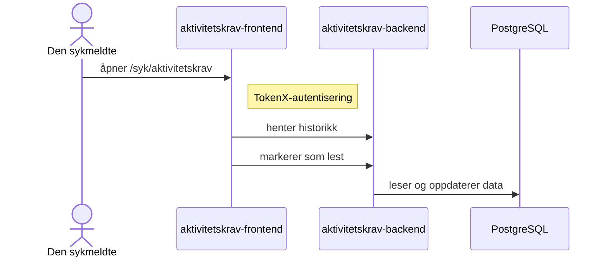
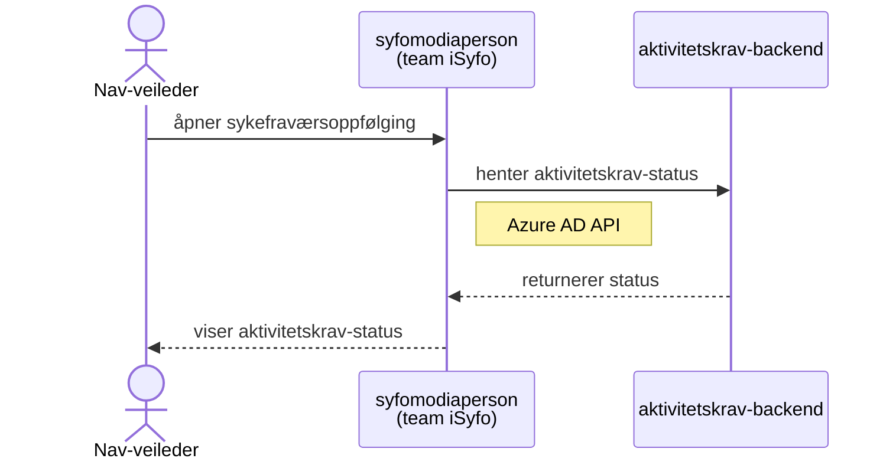

# Aktivitetskrav — teknisk oversikt

Aktivitetskrav-systemet mottar vurderinger fra iSyfo, lagrer dem i aktivitetskrav-backend, varsler den sykmeldte og viser status i [microfrontend](/ordbok#microfrontend) og frontend.

## Dataflyt

### 1. Vurdering og lagring

### 2. Varsling og Min side

### 3. Detaljer og historikk

### 4. Status til veileder

## Kafka-topics

| Topic | Retning | Beskrivelse |
|-------|---------|-------------|
| `teamsykefravr.aktivitetskrav-vurdering` | Inn | Mottar vurderingshendelser fra isaktivitetskrav |
| `teamsykefravr.aktivitetskrav-varsel` | Inn | Mottar forhåndsvarsel om stans av sykepenger |
| `team-esyfo.varselbus` | Ut | Publiserer `SM_AKTIVITETSPLIKT`-hendelser for visning og varsling |

## Systemer

| System | Ansvar |
|--------|--------|
| [isaktivitetskrav](https://github.com/navikt/isaktivitetskrav) | Vurderer aktivitetskrav og publiserer hendelser |
| [aktivitetskrav-backend](https://github.com/navikt/aktivitetskrav-backend) | Lagrer vurderinger og varsler, eksponerer API og publiserer til varselbussen |
| [esyfovarsel](https://github.com/navikt/esyfovarsel) | Sender brukernotifikasjon og styrer synlighet av microfrontend |
| [esyfo-microfrontends](https://github.com/navikt/esyfo-microfrontends) | Viser widget på Min side. Panelet vises ikke ved status `IKKE_OPPFYLT` |
| [aktivitetskrav-frontend](https://github.com/navikt/aktivitetskrav-frontend) | Viser historikk og detaljer for den sykmeldte |
| [syfomodiaperson](https://github.com/navikt/syfomodiaperson) | Viser aktivitetskrav-status til Nav-veileder |
