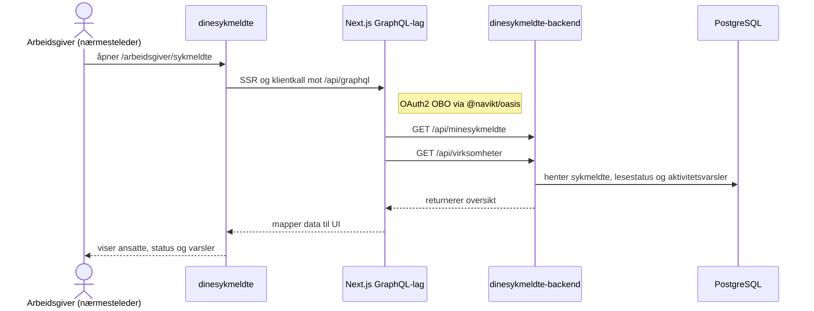
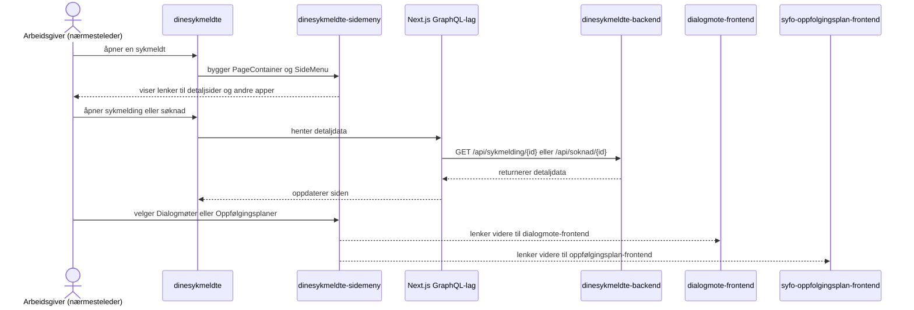
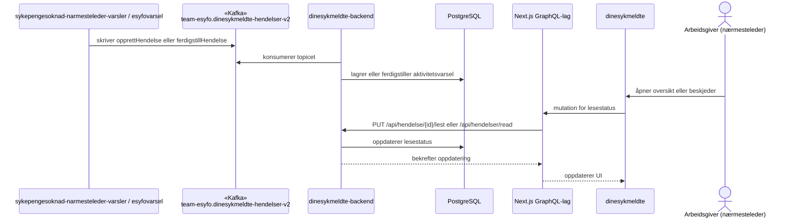

# Dine sykmeldte — teknisk oversikt

Dine sykmeldte består av en Next.js-frontend, et internt GraphQL-lag i frontendappen, en Ktor-backend og en delt sidemeny. Backend lagrer og leser data fra PostgreSQL og holder oversikten oppdatert ved å konsumere hendelser fra Kafka.

## Dataflyt

### 1. Åpne oversikt over sykmeldte

### 2. Åpne detaljside og navigere videre

### 3. Aktivitetsvarsler via Kafka

Aktivitetsvarsler er beskjeder som forteller nærmesteleder at noe har skjedd — for eksempel en ny søknad eller en hendelse i sykefraværsforløpet. Andre tjenester publiserer varsler til Kafka, backend konsumerer dem og viser dem som uleste beskjeder i oversikten.

## Kafka-topics

| Topic | Retning | Beskrivelse |
|-------|---------|-------------|
| `teamsykmelding.syfo-narmesteleder-leesah` | Inn | Oppdaterer koblingen mellom leder og sykmeldt i backend |
| `teamsykmelding.syfo-sendt-sykmelding` | Inn | Gir backend nye og oppdaterte sykmeldinger |
| `flex.sykepengesoknad` | Inn | Gir backend søknadsdata som vises for arbeidsgiver |
| `team-esyfo.dinesykmeldte-hendelser-v2` | Inn | Gir aktivitetsvarsler og ferdigstilling av varsler til oversikten |

## Systemer

| System | Ansvar |
|--------|--------|
| [dinesykmeldte](https://github.com/navikt/dinesykmeldte) | Next.js-frontend for arbeidsgiver. Viser oversikt, detaljsider og intern GraphQL-ruting mot backend |
| [dinesykmeldte-backend](https://github.com/navikt/dinesykmeldte-backend) | Ktor-backend som eksponerer API-er, konsumerer Kafka-topics og lagrer data i PostgreSQL |
| [dinesykmeldte-sidemeny](https://github.com/navikt/dinesykmeldte-sidemeny) | Delt React-bibliotek med sidemeny og layout for Dine sykmeldte, Dialogmøter og Oppfølgingsplan |
| [syfo-oppfolgingsplan-frontend](https://github.com/navikt/syfo-oppfolgingsplan-frontend) | Frontend som arbeidsgiver kan åpne fra sidemenyen når det er behov for oppfølgingsplan |
| [dialogmote-frontend](https://github.com/navikt/dialogmote-frontend) | Frontend som arbeidsgiver kan åpne fra sidemenyen for dialogmøter |
| [esyfovarsel](https://github.com/navikt/esyfovarsel) | Skriver hendelser til Dine sykmeldte-topicet for varsler som skal vises til arbeidsgiver |
| [sykepengesoknad-narmesteleder-varsler](https://github.com/navikt/sykepengesoknad-narmesteleder-varsler) | Produserer hendelser om søknader og andre oppgaver til Dine sykmeldte-topicet |
| [flex-syketilfelle](https://github.com/navikt/flex-syketilfelle) | Leverer informasjon om aktivt syketilfelle som backend bruker i oppfølgingen |
