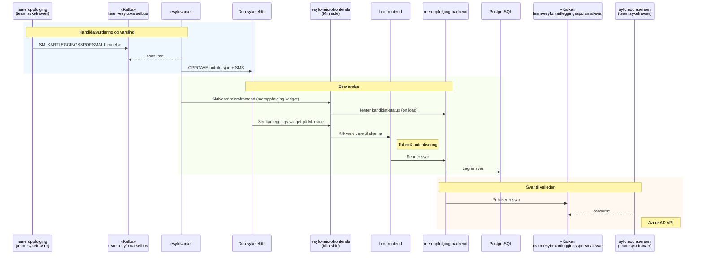

# Kartleggingsspørsmål — teknisk oversikt

Kartleggingsspørsmål-systemet identifiserer sykmeldte som kvalifiserer for kartlegging, varsler dem, presenterer et spørreskjema og gjør svarene tilgjengelige for Nav-veileder.

## Dataflyt

## Kafka-topics

| Topic | Retning | Beskrivelse |
|-------|---------|-------------|
| `team-esyfo.varselbus` | Inn | Mottar `SM_KARTLEGGINGSSPORSMAL`-hendelser fra ismeroppfolging |
| `team-esyfo.kartleggingssporsmal-svar` | Ut | Publiserer kartleggingssvar til syfomodiaperson |

## Systemer

| System | Ansvar |
|--------|--------|
| [ismeroppfolging](https://github.com/navikt/ismeroppfolging) | Vurderer kandidat-status (eid av team sykefravær) |
| [esyfovarsel](https://github.com/navikt/esyfovarsel) | Sender brukernotifikasjon og SMS |
| [esyfo-microfrontends](https://github.com/navikt/esyfo-microfrontends) | Viser kartleggings-widget på Min side |
| [bro-frontend](https://github.com/navikt/bro-frontend) | Kartleggingsskjema (TokenX-autentisert) |
| [meroppfolging-backend](https://github.com/navikt/meroppfolging-backend) | Lagrer svar og publiserer til Kafka |
| [syfomodiaperson](https://github.com/navikt/syfomodiaperson) | Viser svar til Nav-veileder (eid av team sykefravær) |
| [Lumi](https://aksel.nav.no/komponenter/lumi-survey) | Tilbakemeldingswidget for brukerundersøkelser |

## API-dokumentasjon

Se README i de respektive repoene for API-endepunkter:

- [meroppfolging-backend](https://github.com/navikt/meroppfolging-backend)
- [bro-frontend](https://github.com/navikt/bro-frontend)
