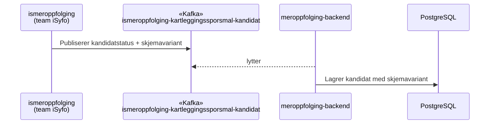
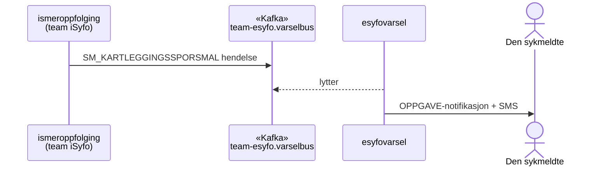
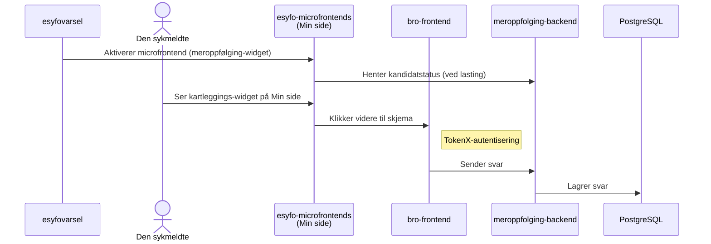
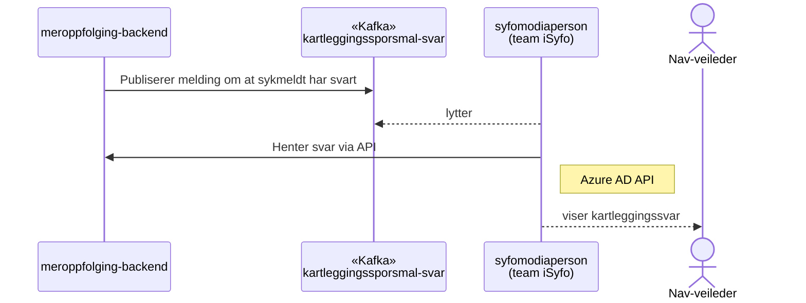

# Kartleggingsspørsmål — teknisk oversikt

Kartleggingsspørsmål-systemet identifiserer sykmeldte som kvalifiserer for kartlegging, varsler dem, presenterer et spørreskjema og gjør svarene tilgjengelige for Nav-veileder.

## Dataflyt

### 1. Kandidatstatus og skjemavariant

### 2. Varsling

### 3. Besvarelse

### 4. Svar til veileder

## Kafka-topics

| Topic                                  | Retning | Beskrivelse                                                              |
| -------------------------------------- | ------- | ------------------------------------------------------------------------ |
| `teamsykefravr.ismeroppfolging-kartleggingssporsmal-kandidat` | Inn | Mottar kandidatstatus og skjemavariant fra ismeroppfolging |
| `team-esyfo.varselbus`                 | Inn     | Mottar `SM_KARTLEGGINGSSPORSMAL`-hendelser fra ismeroppfolging            |
| `team-esyfo.kartleggingssporsmal-svar` | Ut      | Publiserer melding om at sykmeldt har svart, til syfomodiaperson         |

## Systemer

| System                                                                   | Ansvar                                          |
| ------------------------------------------------------------------------ | ----------------------------------------------- |
| [ismeroppfolging](https://github.com/navikt/ismeroppfolging)             | Vurderer kandidatstatus (eid av team iSyfo)     |
| [esyfovarsel](https://github.com/navikt/esyfovarsel)                     | Sender brukernotifikasjon og SMS                |
| [esyfo-microfrontends](https://github.com/navikt/esyfo-microfrontends)   | Viser kartleggings-widget på Min side           |
| [bro-frontend](https://github.com/navikt/bro-frontend)                   | Kartleggingsskjema (TokenX-autentisert)         |
| [meroppfolging-backend](https://github.com/navikt/meroppfolging-backend) | Lagrer svar og publiserer til Kafka             |
| [syfomodiaperson](https://github.com/navikt/syfomodiaperson)             | Viser svar til Nav-veileder (eid av team iSyfo) |
