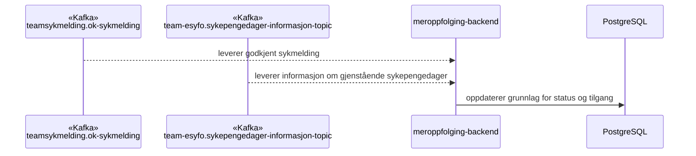
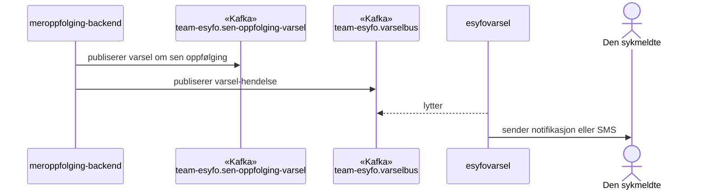
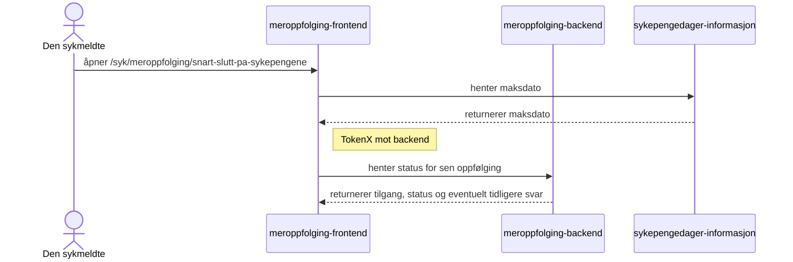
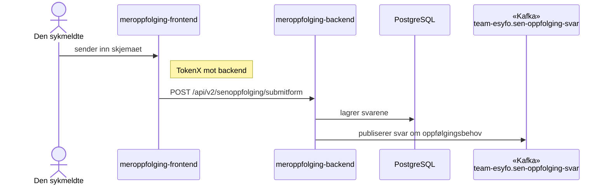
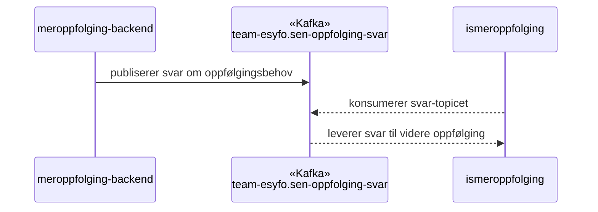
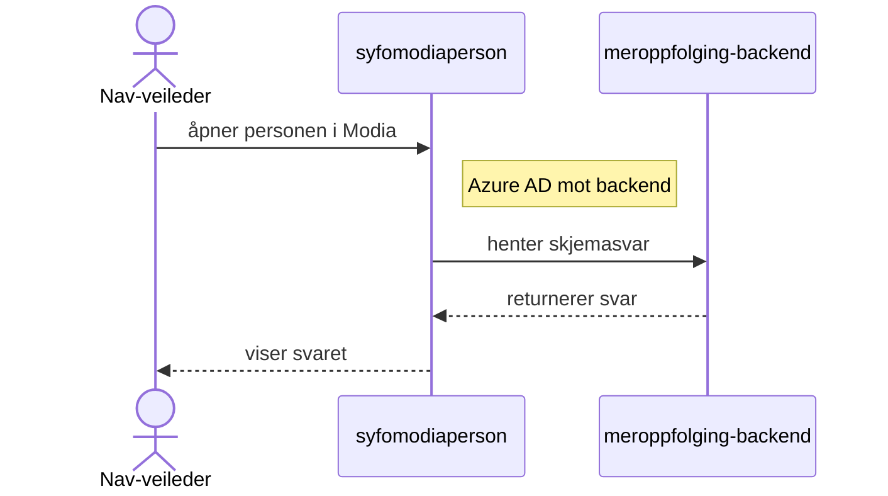

# Meroppfølging — teknisk oversikt

Meroppfølging-systemet gir den sykmeldte informasjon i <Term id="sen-oppfolging">sen fase</Term> av sykefraværet, viser <Term id="maksdato">maksdato</Term> for sykepenger og lagrer svar om behov for videre oppfølging. Backend henter grunnlag fra Kafka, frontend henter maksdato direkte fra API-et til sykepengedager-informasjon, og backend gjør svarene tilgjengelige både i API-er og Kafka-topics.

## Dataflyt

### 1. Grunnlag for sen oppfølging

### 2. Varsler sendes

### 3. Den sykmeldte åpner siden

### 4. Den sykmeldte sender svar

### 5. ismeroppfolging bruker svar-topicet

### 6. Nav-veileder henter svar

## Kafka-topics

| Topic                                         | Retning | Beskrivelse                                                                       |
| --------------------------------------------- | ------- | --------------------------------------------------------------------------------- |
| `teamsykmelding.ok-sykmelding`                | Inn     | Mottar godkjente sykmeldinger                                                     |
| `team-esyfo.sykepengedager-informasjon-topic` | Inn     | Mottar informasjon om gjenstående sykepengedager til backend-grunnlag             |
| `team-esyfo.sen-oppfolging-svar`              | Ut      | Publiserer svar fra sykmeldte om oppfølgingsbehov, som ismeroppfolging konsumerer |
| `team-esyfo.sen-oppfolging-varsel`            | Ut      | Publiserer varsler om sen oppfølging                                              |
| `team-esyfo.varselbus`                        | Ut      | Publiserer varsel-hendelser på Kafka til esyfovarsel                              |

## Systemer

| System                                                                             | Ansvar                                                                                                                  |
| ---------------------------------------------------------------------------------- | ----------------------------------------------------------------------------------------------------------------------- |
| [meroppfolging-frontend](https://github.com/navikt/meroppfolging-frontend)         | Viser informasjon om sen oppfølging, maksdato og skjemaet for den sykmeldte                                             |
| [meroppfolging-backend](https://github.com/navikt/meroppfolging-backend)           | Henter grunnlag fra Kafka, lagrer svar og eksponerer API-er for frontend og syfomodiaperson                             |
| [sykepengedager-informasjon](https://github.com/navikt/sykepengedager-informasjon) | Leverer informasjon om gjenstående sykepengedager via Kafka til backend og maksdato via API til frontend                |
| [esyfovarsel](https://github.com/navikt/esyfovarsel)                               | Lytter på Kafka-topicet `team-esyfo.varselbus` og sender notifikasjon og SMS                                            |
| [syfomodiaperson](https://github.com/navikt/syfomodiaperson)                       | Viser svarene til Nav-veileder i Modia                                                                                  |
| [ismeroppfolging](https://github.com/navikt/ismeroppfolging)                       | Konsumerer Kafka-topicet `team-esyfo.sen-oppfolging-svar` og bruker svarene i videre oppfølging av sykmeldte i sen fase |
