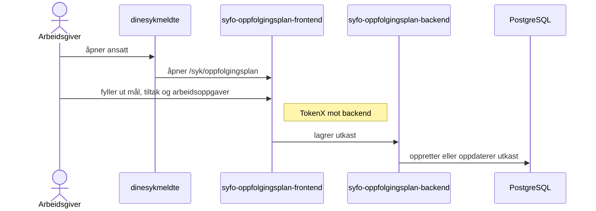
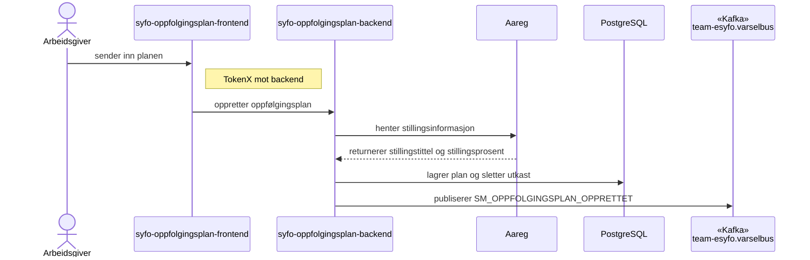
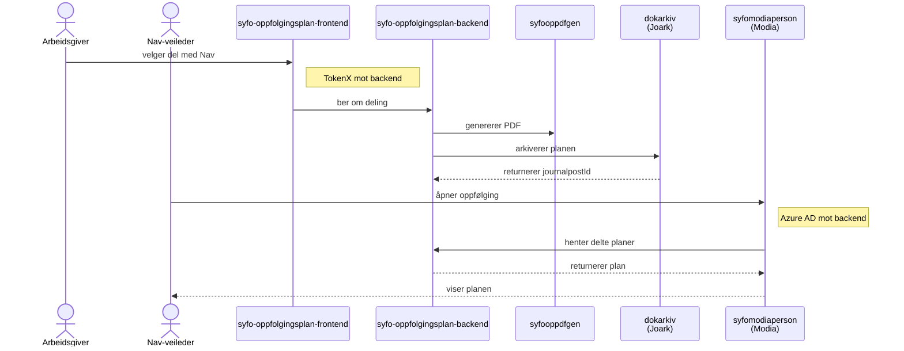
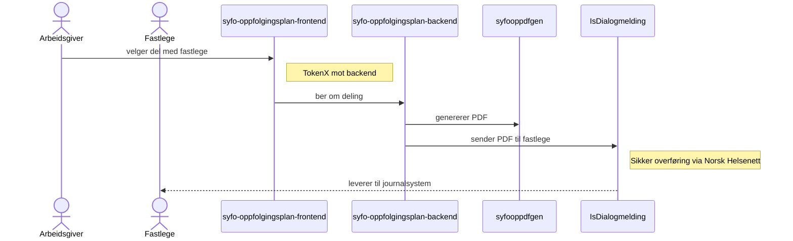
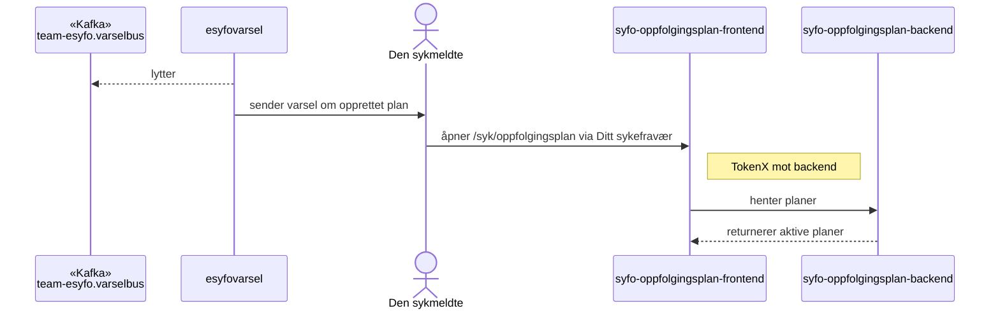
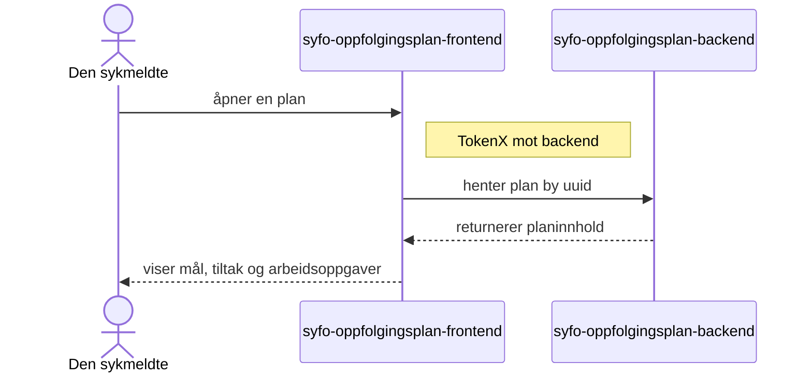

# Oppfølgingsplan — teknisk oversikt

Oppfølgingsplan-systemet lagrer <Term id="utkast">utkast</Term> og planer, henter <Term id="stillingsinformasjon">stillingsinformasjon</Term> fra Aareg, varsler via Kafka og deler ferdige planer med Nav eller fastlege.

## Arbeidsgiverdataflyt

### 1. Lage utkast

### 2. Opprette oppfølgingsplan

### 3. Dele med Nav (valgfritt)

### 4. Dele med fastlege (valgfritt)

## Sykmeldtdataflyt

### 1. Mottar varsel og åpner plan

### 2. Ser innholdet i planen

## Kafka-topics

| Topic | Retning | Beskrivelse |
|-------|---------|-------------|
| `team-esyfo.varselbus` | Ut | Publiserer `SM_OPPFOLGINGSPLAN_OPPRETTET` når en plan er opprettet |

## Systemer

| System | Ansvar |
|--------|--------|
| [syfo-oppfolgingsplan-frontend](https://github.com/navikt/syfo-oppfolgingsplan-frontend) | Viser oppfølgingsplanen for arbeidsgiver og arbeidstaker på `/syk/oppfolgingsplan` |
| [syfo-oppfolgingsplan-backend](https://github.com/navikt/syfo-oppfolgingsplan-backend) | Lagrer utkast og planer, eksponerer API-er og styrer deling |
| [dinesykmeldte](https://github.com/navikt/dinesykmeldte) | Inngang for arbeidsgiver til å starte en plan fra oversikten over ansatte |
| [Aareg](https://www.nav.no/no/nav-og-samfunn/kontakt-nav/for-utviklere/apier/aareg) | Leverer stillingstittel og stillingsprosent når planen opprettes |
| [esyfovarsel](https://github.com/navikt/esyfovarsel) | Lytter på varselbus og sender varsel om opprettet plan |
| [syfooppdfgen](https://github.com/navikt/syfooppdfgen) | Lager PDF av oppfølgingsplanen før deling |
| [syfo-dokumentporten](https://github.com/navikt/syfo-dokumentporten) | Mottar PDF, oppretter dialog i Altinn Dialogporten og gjør planen tilgjengelig for arbeidsgiver via LPS eller innboks |
| [dokarkiv](https://confluence.adeo.no/display/BOA/dokarkiv) | Journalfører planen i Joark ved deling med Nav |
| [IsDialogmelding](https://github.com/navikt/isdialogmelding) (iSyfo) | Sender planen til fastlege ved deling med fastlege |
| [syfomodiaperson](https://github.com/navikt/syfomodiaperson) | Henter delte planer fra backend og viser dem til Nav-veileder |
