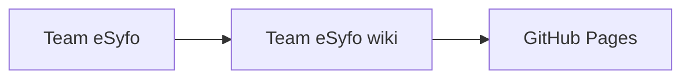

# Systemlandskap

Denne siden er en plassholder for teknisk oversikt over tjenester, integrasjoner og dataflyt.

## Foreslått innhold

- oversikt over applikasjoner og eierskap
- sentrale integrasjoner mot andre systemer
- viktige dataflyter og tekniske avhengigheter

## Eksempel på systemskisse

> [!TIP]
> Bytt ut eksempelet med faktiske systemer når teknisk oversikt dokumenteres.
