# Tidslinje — sykefraværsforløpet

Denne siden viser når de ulike områdene er relevante i et sykefraværsforløp. Forløpet deles inn i tre faser, pluss gjennomgående tjenester som er aktive hele tiden.

## Oversikt

```mermaid
gantt
    title Sykefraværsforløpet
    dateFormat X
    axisFormat %s uker

    section Tidlig fase
    Aktivitetskrav           :active, ak, 0, 8
    Kartleggingsspørsmål     :active, ks, 0, 8

    section Midtveis
    Møtebehov / Dialogmøte  :active, mb, 8, 26
    Oppfølgingsplan          :active, op, 4, 26

    section Sen fase
    Mer oppfølging           :active, mo, 26, 52

    section Gjennomgående
    Dine sykmeldte           :active, ds, 0, 52
    Nærmeste leder           :active, nl, 0, 52
    Delt infrastruktur       :active, di, 0, 52
```

## Tidlig fase (0–8 uker) 🟢

I starten av et sykefraværsforløp er fokuset på tidlig aktivitet og kartlegging.

| Område | Rolle i denne fasen |
|--------|-------------------|
| [⏱️ Aktivitetskrav](/omrader/aktivitetskrav/) | Krever at den sykmeldte vurderer aktivitet |
| [📋 Kartleggingsspørsmål](/omrader/kartleggingssporsmal/) | Samler informasjon for videre oppfølging |

## Midtveis (8–26 uker) 🟡

Etter den tidlige fasen flyttes fokuset til dialog og planlegging mellom partene.

| Område | Rolle i denne fasen |
|--------|-------------------|
| [📅 Møtebehov / Dialogmøte](/omrader/motebehov/) | Avklarer om partene trenger et felles møte |
| [📝 Oppfølgingsplan](/omrader/oppfolgingsplan/) | Dokumenterer tiltak og mål for tilbakeføring |

## Sen fase (26–52 uker) 🟠

Når sykepengene nærmer seg slutt, trengs informasjon om videre valg.

| Område | Rolle i denne fasen |
|--------|-------------------|
| [🔔 Mer oppfølging](/omrader/mer-oppfolging/) | Informerer om maksdato og veivalg videre |

## Gjennomgående tjenester 🔵

Disse områdene er aktive gjennom hele forløpet og støtter de andre områdene.

| Område | Rolle |
|--------|-------|
| [👥 Dine sykmeldte](/omrader/dine-sykmeldte/) | Arbeidsgivers dashboard for all oppfølging |
| [🤝 Nærmeste leder](/omrader/narmeste-leder/) | Sikrer riktig kobling mellom sykmeldt og leder |
| [🔧 Delt infrastruktur](/omrader/delt-infrastruktur/) | Felles tjenester brukt av alle områder |
