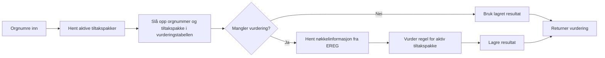

# 🚩 Flaggskipet

Flaggskipet vurderer om en virksomhet havner i tiltaksgruppe, kontrollgruppe eller utenfor scope for en tiltakspakke. Tjenesten brukes i [AID](/aid/) for å styre A/B-testing på en etterprøvbar måte.

Se også [AID-oppdraget](/aid/) og [Funksjonelle endringer](/aid/endringer#_15-a-b-styring-flaggskipet).

**Repo** [navikt/flaggskipet](https://github.com/navikt/flaggskipet)

## Slik fungerer vurderingen

1. En klient kaller `/api/v1/tiltakspakker/vurdering` med ett eller flere orgnumre.
2. Flaggskipet finner hvilke tiltakspakker som er aktive akkurat nå.
3. Tjenesten slår først opp om orgnummeret allerede er vurdert for de aktive tiltakspakkene.
4. Bare når det mangler en vurdering, henter Flaggskipet nøkkelinformasjon fra EREG, blant annet adresse.
5. Regelen for tiltakspakken avgjør utfallet. En tiltakspakke kan ha sin egen regel. Eksempelet i Flaggskipet i dag er geografisk: virksomheter utenfor scope får `UTENFOR_SCOPE`, mens virksomheter i scope fordeles tilfeldig mellom `TILTAKSGRUPPE` og `KONTROLLGRUPPE`.
6. Resultatet lagres per tiltakspakke og orgnummer, slik at samme virksomhet får samme svar neste gang.

## Mulige utfall

| Utfall           | Betyr                                                |
| ---------------- | ---------------------------------------------------- |
| `TILTAKSGRUPPE`  | Virksomheten får tiltakspakken                       |
| `KONTROLLGRUPPE` | Virksomheten følger standardløpet uten tiltakspakken |
| `UTENFOR_SCOPE`  | Virksomheten er ikke med i tiltakspakken             |

## Aktiv tiltakspakke nå

Flaggskipet har én aktiv tiltakspakke nå: `OPPFOLGINGSPLAN_TILTAKSPAKKE_1`. Sluttdato kan settes i koden.

**Regel**

- Scope: virksomheter i Troms og Trondheim
- Fordeling i scope: myntkast 50/50 mellom `TILTAKSGRUPPE` og `KONTROLLGRUPPE`
